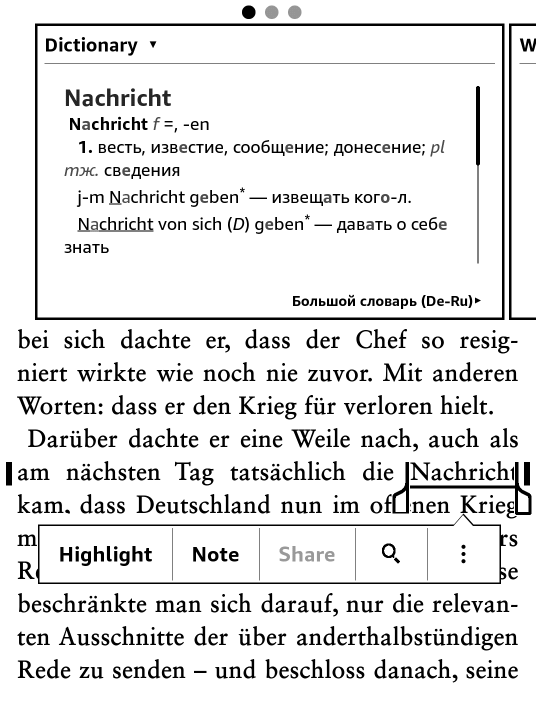
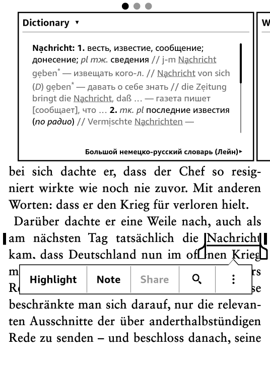

# dsl2mobi

This converter takes a dictionary in Lingvo DSL format and converts
to MOBI dictionary format, suitable for Kindle and Mobipocket Reader.

This a fork of Tvangeste's **dsl2mobi** from https://github.com/Tvangeste/dsl2mobi

## What's new

### dsl2mobi code

New and/or changed features in this fork:

1. Small fixes for new Ruby (ERB constructor)
2. Fixes for DSL language headers (correct German naming, Ukraininan) 
3. New options *(and reused some old short flags)*
 - `-t / --no-title` - do not add card title (header)

	Do not add the card title as a standalone. Useful when the word is repeated in the card body (with stress, syllable breaks etc) to leave more room for the text.

 - `-d / --old-infl` - use old inflection method to allow inflection duplicates on lookup

	Try to use the old (undocumented) syntax to bypass Amazon bug with duplicate inflection words. See [Inflection syntax](#inflection-syntax) below. 

 - `-m / --merge-body` - merge all body lines to m0
 
	Merge all lines from the DSL and use zero margin (as it were m0) - useful to fit cards with long lists into small Kindle popup window. Works best when lines are clearly marked - see [Compactifying cards](#compactifying-cards) below.

 - `-r / --refs-to-infl` - add all card refs to infections"

	Add all DSL refs to inflections. That is, if card "A" points to "B", then headword "A" is added to the list of "B"'s inflections. And when "A" is looked up, card "B" is shown. Useful for popup Kindle dictionary, since links do not work there.

 - `-s [LINES] / --split [LINES]` - split output file by LINES lines (default 10000)"

	Split the resulting html by the specified amount of lines. Useful when one needs to parse/process html (10K lines ~ 5MB html) and helps mobigen/kindlegen a little.

### wordforms

1. Added a new German inflections list. Generated with `dump2morpho.py` script from the dump from http://danielnaber.de/morphologie/ 

   Use with the `-w wordforms/forms_DE_morph.txt` option
   
2. Ukrainian inflection list. `forms-UK.txt`

## Dependencies 

1. Ruby 1.8.7 or later, Ruby 2.0 is recommended:
   http://www.ruby-lang.org/en/downloads/

   For Windows, the following package is recommended:
   http://rubyforge.org/frs/download.php/76804/rubyinstaller-2.0.0-p0.exe

2. Mobipocket creator (to fine-tune the OPF file):
   http://www.mobipocket.com/en/DownloadSoft/DownloadCreator.asp

3. Mobigen or KindleGen (to generate the final MOBI file):
   Mobigen: http://www.mobipocket.com/soft/prcgen/mobigen.zip
   KindleGen: http://www.amazon.com/gp/feature.html?ie=UTF8&docId=1000234621

## How to use

Creation of a Kindle (MOBI) dictionary is a multi-step process.

1. First, we need to convert a DSL dictionary to HTML, and we need to
create so-called OPF file (which is needed by mobigen/kindlegen tools).

   In most typical case, just execute:
  
   `ruby dsl2mobi.rb -i dictionary.dsl -o result_dir`

   This will convert the specificed dictionary.dsl file and put the results
into result_dir directory. You'll get the main HTML file, the OPF file,
the CSS style for the HTML, etc.

   For all command line switches, just execute:

   `ruby dsl2mobi.rb --help`

2. Now, open the OPF file in Mobipocket Creator (or modify manually, which is
less convenient). The point of this step is to adjust/correct the metadata
(which is stored in OPF file). Things like cover image, description,
input and output languages (these are important!), etc.

   Once you're satisfied with your OPF file, proceed to step 3.

3. In this step the actual MOBI dictionary is being generated. Execute:

    `mobigen dictionary.opf`

    or

    `kindlegen -dont_append_source dictionary.opf`

   This command will produce the MOBI file that can be used on Kindle
or with Mobipocket Reader. Mobigen is a command line utility that comes
with Mobipocket Creator.

    You could also use the following command line switch to produce much
smaller, better compressed MOBI file, but it'll take longer to produce it:

    `mobigen -c2 dictionary.opf`

    Alternatively, kindlegen utility can be used, but it is much, *MUCH*
slower, and seems to be hanging on big dictionaries, so use with care.

## Notes 

### DSL validity
It is assumed that the input dictionary is a fully valid DSL dictionary,
   without any errors, duplicates, etc. Essentially, the DSL dictionary
   should be in such a condition that it can be compiled by the Lingvo compiler
   without any errors or warnings.

### Inflection syntax

Amazon's Kindle firmware has a nasty bug with inflection table. If the inflected form duplicates any dictionary entry or another inflection, it is not shown at all.

On top of that there is some heuristic in the Kindle's dictionary algorithm that adds or removes some inflections by itself even if they are not specified in the dictionary.

> :memo: **Example:** When searching for _"saw"_ one could expect to find both the past tense of _"see"_ and the carpentry tool. And that is not the case with the bug mentioned.

The new syntax is documented in the "Amazon Kindle Publishing Guidelines" and in its simplifed form looks like:

```
<idx:orth>see 
    <idx:iform value="saw" /> 
    <idx:iform value="seen" /> 
</idx:orth>  
```

The old syntax (that handles duplicate inflection slightly better) on the other hand looks like this:

```
<idx:orth value="see" infl="saw,seen">
</idx:orth>
```

### Compactifying cards

Kindle popup dictionary has rather small window for displaying a dictionary card. So sometimes it is useful to make a description as compact as possible (like printed dictionaries).

DSL dictionaries, on the other hand, tend to use lists and sublists extensively.

Consider the following to examples - the first as-is and the second with `-t -m`

**As-is**:



**Compacted**




## License

Dsl2Mobi is a copyrighted free and open source software, that can be
distributed under Ruby or GPL License (see LICENSE.txt).


